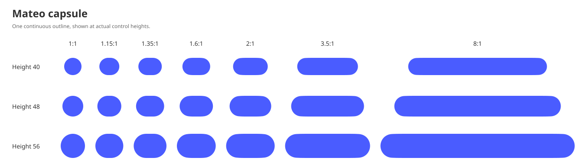

# Capsule — Mateo Design System

> This page records the previous capsule outline used by the existing
> [rounded convex interpolation references](rounded-convex-interpolation.md).
> For current rounded rectangles and pills, use [Rounded shape](rounded-shape.md).

A Mateo capsule defines the shared outline for pill- and capsule-shaped
elements. A compact capsule keeps a flatter top and bottom with softly rounded
shoulders.
Equal dimensions produce a circle. The same construction works vertically.

The [border-radius foundation](border-radius.md#capsule) defines when to use
this shape. A capsule does not define padding, hit targets, elevation, or a text
layout. Keep those decisions with the component.
It does not define the corners of cards, sheets, or other square-like surfaces.



## Proportion and motion

The outline depends only on the current width and height. It has no smoothing
setting and no separate resting, loading, or pressed geometry. When a component
resizes, evaluate the same equations at its current dimensions; the component's
[motion](animations.md) determines how those dimensions change over time.

| Long side / short side | Character                                          |
| ---------------------- | -------------------------------------------------- |
| 1                      | Circle                                             |
| 1.15–1.35              | Compact, flatter across the top and bottom         |
| 1.6                    | Rounded shoulders opening into an extended capsule |
| 2 and greater          | Extended capsule                                   |

These examples describe a continuous curve. They are not width buckets or
values to interpolate between.

## Coordinates and adaptation

All equations below use real numbers. Implementations use at least IEEE 754
binary64 for intermediate calculations. Angles are radians.

Let **H** be the shorter dimension, **L** the longer dimension, and **a = L/H**.
Empty bounds have no outline. Bounds and the normalized ratio must be finite
and representable by the renderer.

Return an empty path when either dimension is nonpositive, the bounds or
aspect ratio are non-finite, or the calculated **n** or **k** is non-finite.

1. Let **t** be **a − 1**, limited to the interval from zero through one.
2. Calculate **s = 6t⁵ − 15t⁴ + 10t³**.
3. Calculate the shoulder weight **b = s + 0.12(1 − t)³(1 − s)**.
4. Calculate the reference proportion **q = 1 + (a − 1)b**.
5. Calculate the central extension **e = a − q**.

Build the upper-right quarter of a reference capsule of width **2q** and height
**2**. Translate that quarter to the right by **e**, connecting its top to
**(0, 1)** with a horizontal segment. Reflect to complete the outline, then
scale both coordinates by **H/2**. Translation preserves the rounded end arcs;
neither axis is stretched or compressed.

At **a = 1**, the outline is the exact circle **x² + y² = 1** before scaling.
At **a ≥ 2**, **q = a** and **e = 0**, so the reference outline is used directly.
The extension and its first two derivatives vanish at **a = 2**. Near equal
dimensions, the extension also vanishes and the shoulders approach a circle.
This keeps compact ends highly rounded while giving the crown a short flat
center. The outermost 45 degrees of each end retain radius **H/2** at every
proportion.

The small correction in **b** gives the most compact shoulders a little more
room to turn smoothly. It fades continuously as the capsule widens.

The reference coordinates use positive y upwards. Construct the upper-right
quarter from **A = (0, 1)** to **Z = (q, 0)**. Reflect and reverse it to complete
one closed outline, in this order:

1. Upper right: original order.
2. Lower right: reflect y and reverse order.
3. Lower left: reflect x and y, original order.
4. Upper left: reflect x and reverse order.

For a horizontal capsule in screen coordinates, transform a point **(x, y)** to
**(centerX + xH/2, centerY − yH/2)** after extension and reflection. For a vertical capsule, use
**(centerX + yH/2, centerY + xH/2)**. Both produce clockwise screen paths.
Apply the final bounds-center translation only after calculating the normalized
geometry.

### Construction order

```text
validate bounds and aspect ratio
if width equals height: return an exact circle in those bounds
calculate q and e
calculate n and k; return an empty path if either is non-finite
if q equals 1 in working precision:
    quarter = unit circular arc from π/2 to 0
else:
    quarter = straight + first-node cubic + six shoulder quintics
            + transition quintic + middle arc + transition quintic + cap arc
convert segments using the portable path representation below, if needed
translate the quarter by (e, 0) and connect its top to (0, 1)
reflect and reverse to complete the four quarters
scale by H/2, apply orientation, and translate to the bounds center
close the path
```

The **q = 1** branch must precede the shoulder-node equations, which contain
**ln(1 − 1/q)**. It also covers a nearly square shape whose reference proportion
rounds to one: retain its central extension **e** rather than stretching the
circle. The exact-square branch has no extension.

## Shoulder equations

The following fixed polynomials define the shoulder. Their constants are
coefficients of powers, not sampled dimensions. Evaluate them in the nested
order shown to keep numerical behavior consistent.

```text
z = (q − 1) / (q + 1)

P(z) = 3.871257456340878
     + z(−12.88611924670383
     + z(52.98714338673223
     + z(−93.58531994541094
     + z(76.23481388943857
     − z · 23.504691269150406))))

Q(z) = 1.2859740959239152
     + z(6.803433630915522
     + z(−39.513958239342216
     + z(81.06757004843966
     + z(−72.45787701452092
     + z · 23.86446258146726))))

w = max(0, (q − 2) / (q + 4))
v = 4w(1 − w)
n = [2 + (q − 1)P(z)](1 − 0.01v³)
k = 1.13276676 + (q − 1)Q(z)
c = √(1/2)
g = 1 − c
xJ = q(1 − 1/k)
```

The factor in **n** softens the shoulder most at **8:1**, by one percent.
It fades continuously towards narrower and longer proportions and leaves
ratios of **2:1** and below unchanged. The circular ends retain their radius.

For a positive shoulder coordinate **x**, define:

```text
u = (x/q)ⁿ
D = q[1 − (1 − u)^(1/n)]
Y = q − D
F(x) = (x, 1 − D)
m = −uY / [x(1 − u)]
b = (n − 1)m / [x(1 − u)]
T = (1, m) / √(1 + m²)
κ = −b / (1 + m²)^(3/2)
```

Here **m** is the slope, **b** its derivative, **T** the unit tangent towards
the cap, and **κ** the positive clockwise curvature. **F** provides the endpoint
and derivative data for the Bézier shoulder; it is not an instruction to sample
an arbitrary polyline.

For small differences, evaluate **D** as
**−q · expm1(log1p(−u)/n)**. `log1p(v)` means the natural logarithm of **1+v**;
`expm1(v)` means **exp(v)−1**, each evaluated without losing small differences.
Use **D** itself in later equations rather than subtracting a rounded y
coordinate from one.

## The circular middle

Let **J = F(xJ)** and **M = (q − g, c)**. The cap after M is part of the unit
circle centered at **(q − 1, 0)**. Calculate the intervening circle as follows:

```text
τ = −m(xJ)
d = [xJ − τ(Y(xJ))] / (1 − τ)
R = √2(q − d − g)
V = M − J
ℓ = length(V)
C = (J + M)/2 − √(R² − ℓ²/4) · (−Vy, Vx)/ℓ
αJ = atan2(Jy − Cy, Jx − Cx)
αM = atan2(My − Cy, Mx − Cx)
δ = 0.12(1 − 1/q)
```

For an angle **α**, this circle supplies the state:

```text
point = C + R(cos α, sin α)
tangent = (sin α, −cos α)
curvature = 1/R
```

The shoulder ends at **B = F(xJ − δ)**. A Bézier transition joins B to the
circle at **αJ − δ**. Follow that circle clockwise to **αM + δ**, then use
another Bézier transition to M with tangent **(c, −c)** and curvature **1**.
Finally, follow the unit cap circle from angle **π/4** to zero.

These two transitions distribute the change of tangent and curvature over a
short interval. They disappear continuously as the reference becomes circular.

## Bézier shoulder

Calculate seven shoulder nodes, with **i** taking the integer values zero
through six:

```text
v0 = 16 − ln(1 − 1/q)
v6 = −n · ln((xJ − δ)/q)
vi = v0 + (v6 − v0)i/6
xi = q · exp(−vi/n)
```

At each node, evaluate F, m, b, T, and κ from the shoulder equations. The six
intervals are fixed parts of the construction, regardless of the dimensions.

### Joining the straight to the first node

Let the first node be **E = F(x0)**, with its previously calculated D, m, and κ.
Define:

```text
h = −D/m
e2 = Ex − h
e1 = e2 − 3κ(h² + D²)^(3/2)/(2D)
e0 = e1²/e2
```

Draw a straight from A to **(e0, 1)**, followed by a cubic Bézier with controls:

```text
(e0, 1), (e1, 1), (e2, 1), E
```

The first three controls are collinear, giving zero curvature at the straight.
The last handle has E's tangent. The e1 equation follows from the cubic's
endpoint-curvature formula and gives E's curvature. The straight tail and its
transition shrink to zero at the circular limit.

### Connecting shoulder nodes

For each consecutive pair of nodes **E0** and **E1**, let **h = E1x − E0x**,
**V0 = (h, hm0)**, **V1 = (h, hm1)**, **A0 = (0, h²b0)**, and
**A1 = (0, h²b1)**. Use this degree-five Bézier:

```text
E0
E0 + V0/5
E0 + 2V0/5 + A0/20
E1 − 2V1/5 + A1/20
E1 − V1/5
E1
```

These coefficients follow from a quintic's endpoint derivatives:
**B′(0)=5(B1−B0)** and **B″(0)=20(B2−2B1+B0)**, and the corresponding
expressions at its other end. Adjacent segments therefore share position,
tangent, and curvature.

## Bézier joins to the circles

Use the same quintic construction for the two circular-middle transitions.
For their endpoint states **E0, T0, κ0** and **E1, T1, κ1**, calculate:

```text
ℓ = length(E1 − E0)
N0 = (T0y, −T0x)
N1 = (T1y, −T1x)
V0 = ℓT0                 V1 = ℓT1
A0 = ℓ²κ0N0             A1 = ℓ²κ1N1
```

Insert these values into the six-control quintic above. Its endpoint
accelerations are normal to the tangents, so its endpoint curvatures are
exactly κ0 and κ1. This defines the complete canonical quarter without a
framework-specific corner primitive.

## Portable path representation

A renderer with exact circle and degree-five Bézier support may draw the
canonical segments directly. A cubic-only renderer uses the following common
conversion. Do not independently refit the silhouette in each framework.

For each quintic **B**, split its parameter interval into two equal intervals.
For an interval **[u, v]**, use cubic controls:

```text
B(u)
B(u) + (v − u)B′(u)/3
B(v) − (v − u)B′(v)/3
B(v)
```

Evaluate B with Bernstein polynomials or de Casteljau interpolation. Evaluate
B′ as the degree-four Bézier with controls **5(Bi+1 − Bi)**.

For a clockwise circular arc from **α** to **β**, split into equal intervals
no larger than **π/4**. In each interval, let **h = 4R·tan((β−α)/4)/3** and use:

```text
E0 = C + R(cos α, sin α)
E0 + h(−sin α, cos α)
E1 − h(−sin β, cos β)
E1 = C + R(cos β, sin β)
```

Retain a native exact-circle primitive when available for equal dimensions.
The cubic-only fallback uses eight equal arcs around the circle. A straight
may be represented by a line or a cubic with controls at one-third and
two-thirds of its length. Close the completed path explicitly.

The conversion budget is **0.01H/48** logical units of contour error. For a
quintic, a conservative Euclidean error bound per interval is
**max|B⁽⁴⁾|·(v−u)⁴/384**, multiplied by **H/2**.
Its fourth derivative is linear, so the maximum is bounded by its two endpoint
norms, calculated as **120** times the fourth differences of the controls.
This bound is checked alongside the [reference fixtures](assets/capsule/reference.json).
Conversion preserves shared endpoints and tangents; small curvature residuals
from cubic approximation must not be confused with the canonical construction.

## Reproduction and visual checks

The [reference fixtures](assets/capsule/reference.json) contain dimensions, canonical
quarter segments, and the cubic path controls in screen coordinates. They are
conformance examples, never runtime geometry tables. They include all seven
reference proportions, actual control heights, and a vertical capsule.

The [curvature drawing](assets/capsule/curvature.svg) shows the canonical joins and
normal directions. Compare the [reference silhouettes](assets/capsule/reference.svg)
at actual sizes as well as enlarged curves.

Implementations must agree on the geometric outline within the conversion
budget. Edge pixels may differ because renderers use different antialiasing.
Check bounds, circle identity, symmetry, convexity, closure, and intermediate
proportions. Account for floating-point precision when inspecting segments
whose lengths approach zero near the circular limit.

Use the same path for a component's background, clipping, and shadow. The shape
itself adds no inset or painted stroke. Retain the component's inherited
accessibility, text-scaling, and reduced-motion behavior.
