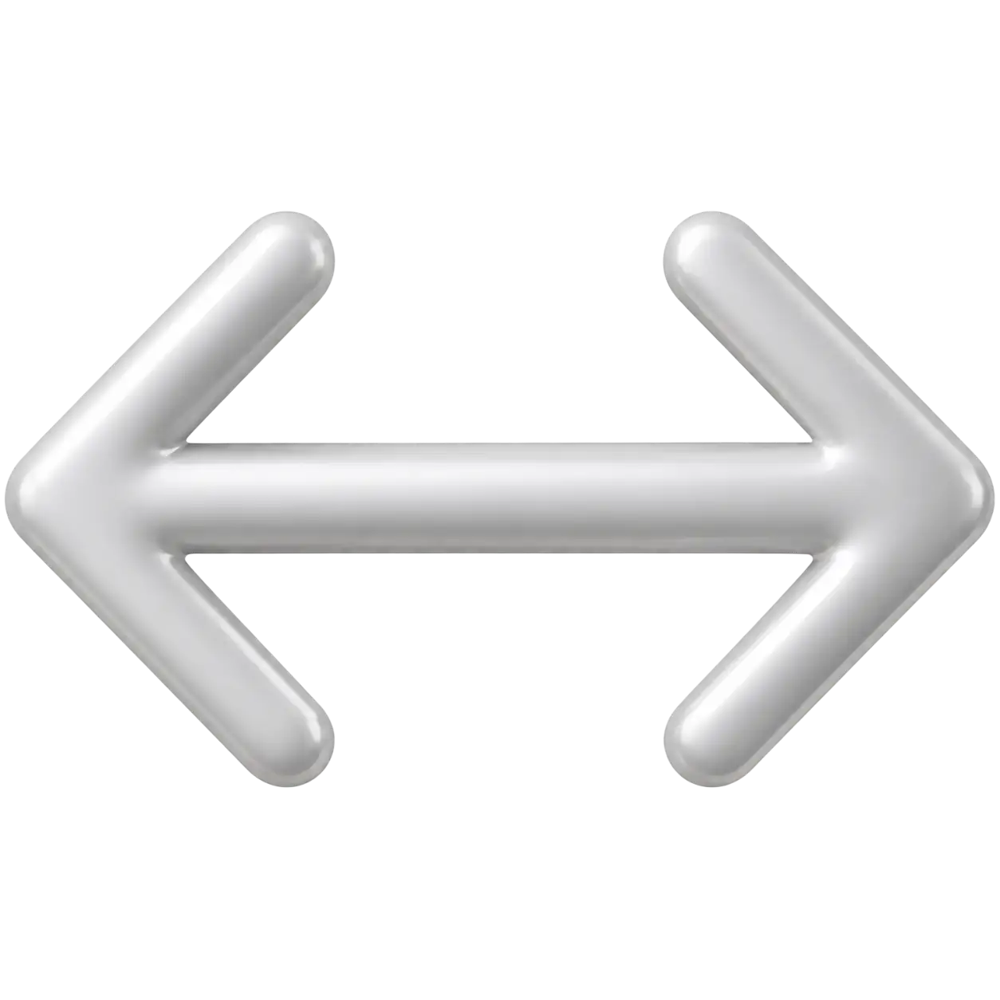
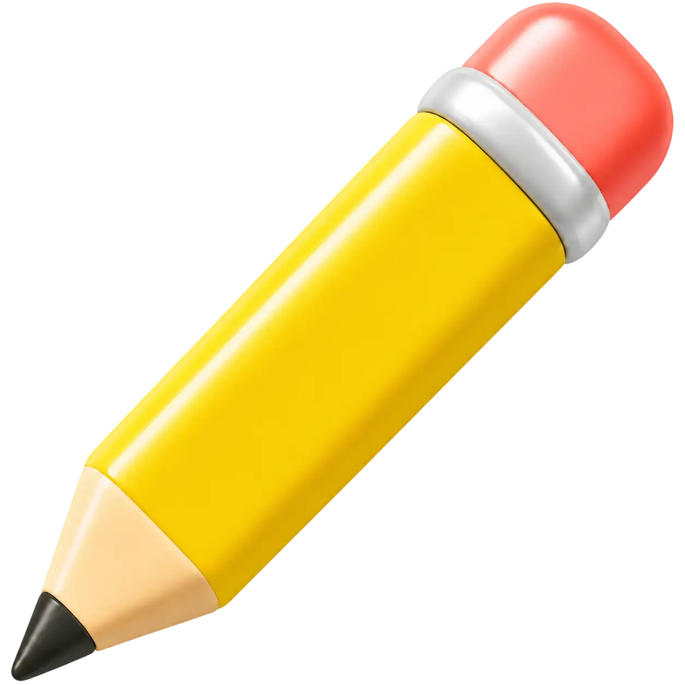

# Icons - Mateo Design System

Mateo icons are simple, expressive, and immediately understandable. Their job
is to make an interface feel obvious and alive without adding visual noise.
Each icon represents one familiar concept, object, or action with the least
detail needed to recognize it confidently.

Icons should feel friendly and purposeful. Use them to clarify an action,
reinforce a message, show direction, or make a state easier to notice. Do not
use them as decoration or as a substitute for a clearer text label.

The available icon assets live in this folder, grouped by visual treatment.
Use the asset appropriate to the component and platform, or the equivalent icon
API provided by the package for your platform.

## Principles

Mateo icons follow these principles:

- **Obvious at a glance.** Prefer familiar metaphors that people can recognize
  without learning Mateo first.
- **One clear idea.** Each icon expresses one primary concept. Remove detail
  that does not improve recognition at the rendered size.
- **Warm, not ornamental.** Friendly geometry and confident visual weight give
  the set personality, but clarity always comes before decoration.
- **One visual family.** Icons using the same treatment should share a coherent
  level of detail, visual weight, geometry, and finish. Choose the Mateo
  treatment appropriate to the context and use it consistently within a
  component or repeated set.
- **Self-descriptive in context.** Pair an icon with text whenever the action or
  state is not immediately clear. Mateo should help people understand, not make
  them decode a private visual language.
- **Native to the platform.** Size, target, direction, motion, and accessibility
  behavior belong to the component and must respect the intended platform.
- **Named by appearance.** Name an icon for what it depicts, not for a single
  product behavior. A `clock` can support time or waiting; it is not named
  `pending`.

## Icon catalog

The name in this table is the canonical icon name. An icon may be available in
more than one visual treatment. Platform APIs may adapt the name to their
language conventions, such as `arrowLeft` in Dart.

| Icon                                                             | Name                    | Use                                                                                                           | Do not use for                                                                            |
| ---------------------------------------------------------------- | ----------------------- | ------------------------------------------------------------------------------------------------------------- | ----------------------------------------------------------------------------------------- |
|                        | `arrow-down`            | Downward direction or a downward gesture. Pair gesture instructions with motion or text.                      | Download, collapse, or sort descending unless the component clearly establishes that meaning. |
|                        | `arrow-left`            | Back or previous navigation when the destination is clear from context.                                       | Undo, reply, or an arbitrary leftward action.                                             |
|                      | `arrow-right`           | Forward or next navigation when the destination is clear from context.                                        | Redo, send, sign out, or an arbitrary rightward action.                                   |
|        | `arrow-rotate-clockise` | Retry, reload, refresh, or repeat when the surrounding label or component makes the action explicit.          | History, undo, or automatic synchronization without supporting context.                   |
|                            | `arrow-up`              | Upward direction or an upward gesture. It may support a swipe-up instruction when paired with motion or text. | Upload, send, or sort ascending unless the component clearly establishes that meaning.    |
|                      | `banknote-pin`           | A fixed or pinned monetary value, such as an agreed payment, set budget, or target amount. Pair it with the value or label. | An estimated, flexible, or negotiable amount, a generic payment action, or a geographic location. |
|   | `bidirecional-horizontal-arrow` | A horizontal range, two possible directions, or movement that may happen toward either side. Pair it with context that names the range or choice. | One-way navigation, exchange or transfer between items, or an unlabeled action.            |
|                                | `box-pen`               | Edit or compose content when the component or label identifies what will change.                              | Save, settings, or a generic indication that content is editable without an action.       |
|                    | `chevron-down`          | Reveal content below, expand a collapsed region, or indicate a downward selection control.                    | Download or a general down arrow.                                                         |
|                    | `chevron-left`          | Back or previous navigation, or collapse toward the left, when the surrounding component makes the action clear. | Undo, reply, or general leftward movement where `arrow-left` communicates direction more clearly. |
|                      | `circle-block`          | Blocked, prohibited, unavailable, or not allowed. Pair it with a reason when the state affects a task.        | Delete, cancel, or a generic error.                                                       |
|                    | `circle-check`          | Successful completion or a confirmed positive result. Pair it with text that names what completed.            | Selection, approval, or a decorative checkmark without a completed outcome.               |
|              | `circle-info`           | Contextual information or a timely fact that helps explain the current state. Pair it with the information.   | Help, a warning, or decoration that does not communicate useful information.              |
|                                           | `clock`                 | Time, schedule, duration, waiting, or a pending state.                                                        | History unless the surrounding control explicitly establishes history.                    |
|                                           | `cross`                 | Close, dismiss, clear, or remove from a reversible context. The component must make the exact action clear.   | Error status by itself or an unlabeled destructive action.                                |
|       | `exclamation-circle`    | A problem, exception, or important status that needs attention. Pair it with an explanation.                  | General information or a warning about a possible future risk.                            |
|   | `exclamation-triangle`  | Warning, caution, risk, or a condition that may require care before continuing. Pair it with an explanation.  | A confirmed error when `exclamation-circle` is the established status symbol.             |
|   | `handshake`             | Agreement, partnership, collaboration, or a completed deal when the surrounding text names the relationship. | A greeting, generic people, or approval without a shared commitment.                      |
|                     | `magnifying-glass`      | Search or find.                                                                                               | Zoom unless the surrounding component explicitly establishes zoom.                        |
|                             | `location-pin`          | A place, address, or point on a map.                                                                          | The person's current location or navigation direction without additional cues.            |
|   | `padlock`               | Security, privacy, locked content, or a protected action when the surrounding text names what is protected.   | A general warning, unavailable content, or proof that a system is secure.                  |
|   | `pencil`                | Writing, drawing, or editing when the surrounding component or label identifies what will change.             | Save, settings, or a generic indication that content is editable without an action.       |
|                                   | `phone`                 | Calling or a phone number.                                                                                    | A mobile device; use `smartphone` for the device itself.                                  |
|                                 | `plus-signal`           | Add or create something, or increase a quantity when the surrounding component makes the operation explicit.  | Close, remove, expand, or a positive status without supporting text or context.           |
|    | `pointer-hand-up`       | A tap, touch, press, or gesture instruction. Use it in guidance where the interaction is demonstrated.        | A general cursor, selection state, or permanent navigation icon.                          |
|                            | `questionmark`          | Help, support, or an answer to a question when the surrounding component makes the destination clear.         | General information, an unknown status, or punctuation within text.                       |
|                   | `rectangle-stack`       | A collection, layered content, or a stack of cards or pages.                                                   | Copy, duplicate, window switching, or a single item without supporting context.            |
|                   | `road`                  | A road, route, or road-based travel context.                                                                   | Turn-by-turn direction, current location, or a generic path or process.                    |
|                                 | `smartphone`            | A mobile device, mobile experience, or interaction happening on a phone.                                      | Calling; use `phone` for the call action.                                                 |
|                                             | `tree`                  | Trees, parks, vegetation, or a natural outdoor place.                                                          | Generic sustainability, growth, or success without supporting context.                    |
|                                | `whatsapp`              | An action or destination that is specifically WhatsApp. Keep an accessible label naming WhatsApp.             | Generic messaging, calling, or Mateo-owned communication.                                 |
|  | `wifi-exclamation-mark` | No internet, unreliable connectivity, or a network connection that needs attention.                           | A server, account, or generic application error without evidence of a connection problem. |
|                                         | `wrench`                | Tools, repair, maintenance, or technical configuration.                                                       | Generic settings when the action is not about tools or maintenance.                       |

## Usage rules

### Labels and accessibility

- An interactive icon must receive an accessible name from its component. The
  name describes the action, such as “Close” or “Retry”, not the picture, such
  as “Cross” or “Circular arrow”.
- Hide a purely decorative or repeated icon from assistive technology.
- Pair status icons with text. Do not rely on the symbol or its color alone to
  communicate an error, warning, blocked state, or connection problem.
- Do not bake explanatory copy into an icon asset. Text belongs to the component
  so it can be translated, resized, and announced correctly.

### Size and placement

- Preserve the icon's aspect ratio. Do not stretch it to fill a square.
- Choose icon size in the component or platform specification, and test the
  result at its actual rendered size. Small icons must remain recognizable.
- Treat icon size and interactive target size as separate decisions. A small
  icon still needs the touch or pointer target required by its platform.
- Align icons by perceived visual weight, not only by their raw asset bounds.
  When an icon sits beside text, center it optically with the text line.
- Keep the icon asset unchanged. Add any spacing or alignment adjustment around
  the icon in the component that uses it.

### Color and state

- Mateo icons may use a monochrome or authored full-color treatment.
  Implementations must allow the component's semantic color to recolor a
  monochrome icon without hardcoding a palette primitive in the asset.
- Black is the base color of monochrome assets, not a required displayed color.
  The component's color scheme determines the displayed color and must provide
  sufficient contrast against its background. Preserve the authored colors of
  full-color assets and verify that the complete icon remains distinguishable
  against its background.
- Interaction states belong to the component, not the icon asset. Show pressed,
  disabled, selected, or focus states through the component instead of using a
  recolored asset as the only state cue.
- Use motion only when it explains state or action, such as retry progress or a
  gesture hint. The owning component defines timing and reduced-motion behavior.

### Direction and localization

- Mirror `arrow-left`, `arrow-right`, or `chevron-left` only when the
  component's navigation or disclosure direction and locale require it. Do not
  assume every horizontal directional icon should mirror globally.
- Do not mirror `arrow-down`, `arrow-rotate-clockise`, `arrow-up`,
  `chevron-down`, status symbols, objects, or brand marks.
- Validate metaphors in the languages and cultures where a product ships.
  Replace or support an icon with text when its meaning is not dependable.

### External brand mark

`whatsapp` is an external brand mark, not a Mateo system metaphor. Use it only
to identify WhatsApp, keep the name visible or accessible, and follow the
current WhatsApp brand requirements. Never redraw it to match a different icon
style or use it as a generic communication symbol.
