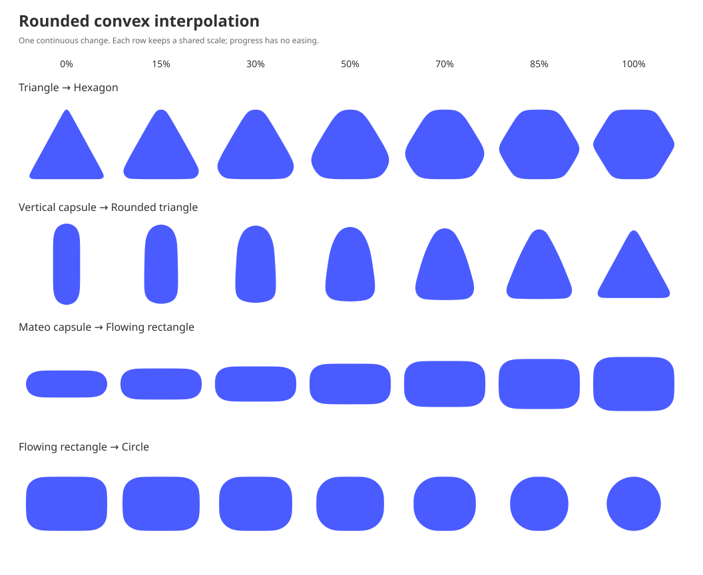
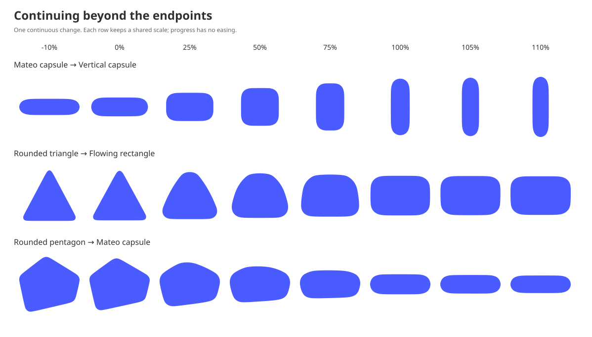
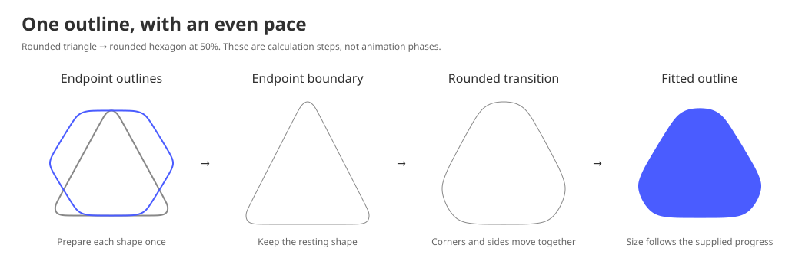
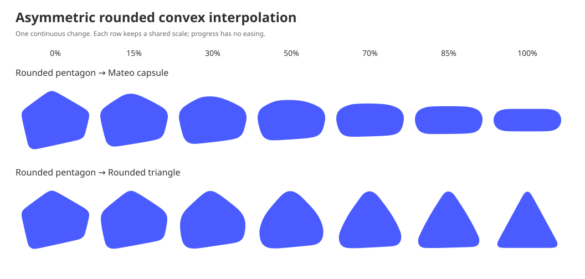

# Rounded convex interpolation — Mateo Design System

Rounded convex interpolation changes one outward-rounded outline into another
while keeping it recognizable as the same surface. Its sides, shoulders, and
corners move together at an even pace. Long sides grow while rounded ends
retain their character, and changing corners stay soft throughout the movement.

Use it when a surface changes its outline: a capsule opening into a panel, a
compact shape becoming a larger container, or one convex silhouette becoming
another. It defines geometry, not a duration, easing curve, layout, or component
API. Follow [animation](animations.md) for timing, interruption, reduced motion,
and the coordination of content, clipping, feedback, and shadow.

## The shared result

The shared contract is the visible movement, rather than identical control
points or identical edge pixels in every framework.

- Keep one closed, convex outline throughout the transition. A convex shape
  has no inward dent: the straight segment between any two interior points
  stays inside it.
- Let recognizable features move from the beginning. Avoid a bottom edge
  waiting while the upper corners change, or a shoulder appearing suddenly
  halfway through.
- Carry endpoint rounding through the movement. Keep changing corners soft
  and preserve the parallel sides and rounded ends of a capsule as it opens
  into a panel.
- Keep the outline smooth around its perimeter, without visible joins,
  self-intersections, or local corners introduced by the interpolation.
- Keep the same endpoint independent of its partner. Interpolating a shape
  with itself must leave it still. Reversing the endpoints and progress must
  retrace the same silhouettes.
- Arrive on the component's resting shape without a final correction or snap.
  A numeric approximation is acceptable only while the difference is not
  visible at the component's actual size.

The [capsule](capsule.md), [rounded rectangle](rounded-rectangle.md), and
[border-radius](border-radius.md) foundations continue to own the resting
shapes. Rounded convex interpolation does not replace their definitions or
introduce a new radius. A resize that changes only an existing shape's
dimensions or radius can continue to evaluate that shape's own equations.

### Supported outlines

The construction below accepts a single convex boundary with positive width,
height, and area. It is handcrafted for Mateo's rounded shapes, including flat
sides, unequal dimensions, and asymmetric outlines with rounded corners.

Any valid single convex outline is accepted, including custom and sharp
outlines. There is no required radius or list of permitted shape families.
Sharp outlines pass through the same equations, but their corners can soften
and their motion can change their character. Choose another transition when
exact sharp geometry matters.

Supply each shape's finished boundary and dimensions. That boundary is the
intended endpoint, including any rounding it already has. A straight-edged path
is also a finished boundary; it does not select a separate preparation mode.

Holes, concave silhouettes, disconnected regions, and a transition through
zero area are not covered by this construction. Do not silently replace a
concave outline with its convex hull. Choose another component transition
when its topology falls outside this scope.

Treat empty bounds as having no drawable outline. Reject non-finite geometry
before it reaches the renderer. A platform adapter may use its normal invalid
input behavior; the equations below assume valid, representable inputs.

## Geometry and time

Let **A** and **B** be the source and destination outlines. Let **t** be the
progress supplied by the component after its timing curve or spring has been
applied. Zero is A and one is B. Values below zero or above one continue the
shape beyond an endpoint; do not limit them to **[0, 1]** before evaluation.

Evaluate one coordinated geometric transition. Rounded shape changes follow
a prepared movement map so the outline advances evenly. Physical dimensions
follow the supplied progress. Beyond the endpoints, bound the outline
excursion separately from dimensional resistance, allowing a visible size
rebound without a large change in local features. The component continues to
own its timing curve; the map measures distance through the shape change.

### Positive interpolation and continuation

Use the following function **P(a, b, v)** for two nonnegative edge lengths a
and b and a progress v. When v is outside the endpoint interval, first replace
each input smaller than **10⁻¹² logical units** with that positive minimum. Between zero and one:

**P(a, b, v) = (1 − v)a + vb**

Outside that interval, take the nearest endpoint value x and the continued
linear displacement z:

- Below zero: **x = a**, **z = (b − a)v**.
- Above one: **x = b**, **z = (b − a)(v − 1)**.

For **z ≥ 0**, use **P = x + z**. For **z < 0**, let **q = −z/x** and use:

**P = x / (1 + q + q²)**

An increasing value continues linearly. A decreasing value approaches zero
without crossing it. For positive input lengths, value, first derivative, and second derivative
agree with the linear interval at both endpoints. An absent edge has zero
length inside the interval; its continuation uses the numerical minimum.

### Dimensions and outline progress

The physical bounds follow the supplied progress with increasing resistance
beyond either endpoint. Use **D(a, b, t)** for dimensions. Inside **[0, 1]**,
**D(a, b, t) = (1 − t)a + tb**.

Outside that interval, take the endpoint x and continued displacement z as in
the positive scalar continuation above. Set **r = z/x**, then soften this
relative displacement with **c = 0.2**:

**s = r / √[1 + (r/c)²]**

For **s ≥ 0**, use **D = x(1 + s)**. For **s < 0**, use
**D = x / (1 − s + s²)**. Evaluate the square-root normalization with a
numerically stable method to avoid overflow when squaring a large ratio.

Small excursions stay close to the endpoint's incoming motion. Larger
relative changes meet more resistance, so a tall panel returning to a shallow
capsule settles without becoming excessively flat. This rule applies to every
dimension and shape pair. It preserves the endpoint value, first derivative,
and second derivative of the linear interval in both directions.

The softened relative displacement approaches **−0.2** or **0.2**. The
dimension therefore approaches **x/1.24** when shrinking or **1.2x** when
growing. These are smooth dimensional limits, not a clamp on animation
progress or a prescribed amount of spring overshoot.

**W(t) = D(Wₐ, Wᵦ, t)**\
**H(t) = D(Hₐ, Hᵦ, t)**

Inside **[0, 1]** these dimensions are linear. A **144 × 48** source and a
**240 × 280** destination therefore have bounds **192 × 164** at **t = 0.5**.
When a width changes from **144** to **48**, its width at **t = 1.1** is about
**41.33**. A **240 × 280** panel returning to a **144 × 48** capsule at the
same progress has bounds about **134.93 × 39.38**. Translation on screen
remains owned by the component.

For the physical edge construction, use outline progress **q(t)**:

| Supplied progress t | Outline progress q(t) |
| --- | --- |
| t < 0 | 0.08 tanh(t/0.08) |
| 0 ≤ t ≤ 1 | t |
| t > 1 | 1 + 0.08 tanh[(t − 1)/0.08] |

Here **tanh** is the hyperbolic tangent. Evaluate it with a numerically stable
method. This increasing mapping satisfies **q(1 − t) = 1 − q(t)**, has slope
one and matching second derivatives at both endpoints, and approaches
**−0.08** and **1.08** outside them. Those are outline limits, not limits on
the component's spring or physical bounds. At **t = 1.1**, **q ≈ 1.06786**.

Follow [shape animation](animations.md#shape-and-clipping) when choosing how
far a component should rebound. The reference exercises progress from
**−0.5 through 1.5**, including endpoint crossings. Reject non-finite or
collapsed calculations instead of drawing invalid geometry. Finite input alone
does not guarantee representability at arbitrary scales.

## Portable construction

Prepare the finished endpoint outlines independently, then select the pair
construction from their straight features. Rounded pairs also prepare a map
of movement through their outlines. Every frame evaluates the geometry at the
requested progress; the map stores scalar correspondence, not rendered frames.
All outlines use the same rules; no step selects a shape family.

Use clockwise screen coordinates, with positive x rightward and positive y
downward. Retain physical width and height. Endpoint fitting uses centered unit
bounds; edge interpolation uses **physical logical units**, so a shallow
capsule's rounded end does not stretch into a panel's corner profile.

### 1. Prepare endpoint edges

Construct each resting outline from its owning foundation or custom boundary.
Use the [endpoint fit](#endpoint-fit) below to reproduce the reference's
independent approximation. When an evaluated transition becomes a new endpoint, retain its polygon
without fitting or rounding it again. Compact that polygon using
[polygon compaction](#polygon-compaction) with
the finer **0.003 logical-unit** endpoint tolerance; repeated interruptions
should not keep accumulating redundant edges. Preserve its coordinate extrema.

Convert each fitted cubic to physical coordinates. Subdivide at its midpoint
until both interior Bézier controls are within **0.003 logical units** of the
segment joining its endpoints. Distance is to the finite segment, including
its ends. Use the first point of each accepted subcurve, in boundary order,
to form the closed polygon. A subdivision depth beyond **24** is unsupported.

For each polygon edge, retain its length and tangent angle in **[0, 2π)**.
Ignore lengths smaller than **10⁻¹⁰ logical units**. Sort edges by angle.
Merge the two endpoint lists in that order. Angles differing by less than
**10⁻¹⁰ radians** share one direction, using the source angle; retain the two
lengths separately. A direction absent from an endpoint has length zero.

This merged representation is used for the physical edge construction and
at exactly **t = 0** or **t = 1**. Capsule-to-rectangle transitions retain
their complete edge representation and shared straight directions.

For extreme scales, keep each subdivision or compaction tolerance between
**10⁻⁸** and **10⁻³** of the endpoint's longer dimension, using the ordinary
pixel value whenever it lies inside that range. Limit each ignored-edge
threshold to at most **10⁻¹²** of that dimension. For continued lengths, limit
the positive minimum to at most **10⁻¹²** of the longer dimension across both
endpoints. These numeric safeguards keep tiny and enormous coordinate ranges
representable; they do not prescribe additional component sizes.

### 2. Find straight features and changing corners

For each endpoint edge direction, consider all edge directions within **0.5°**
on either side, wrapping around the circle. Add their physical lengths. A
window is a straight-feature candidate when that total is at least **18%** of
the endpoint's shorter dimension. Its direction is the midpoint of its first
and last included angles, and its span is their difference.

Consider candidates from greatest to least total length; ties use increasing
feature direction. Retain a candidate only if its direction is at least **3°**
from every feature already retained. Finally sort retained features by angle.
This selects each straight feature once and avoids making its classification
depend on an arbitrary starting gap in a symmetric outline.

An edge belongs to the first own-endpoint feature whose angular distance from
it is at most half that feature's span plus **10⁻⁸ radians**. Its eligibility
spread is zero if there is no such feature, the other endpoint has fewer than
two features, or the other endpoint has a feature within **3°** of that
feature's direction.

Otherwise, let **l** and **r** be the smallest counterclockwise and clockwise
angular distances from the own feature to the other endpoint's features.
Set **u = (π − l − r − 6°)/(60° − 6°)**, limiting u to the interval zero through
one, and define its eligibility spread:

**s = 0.9 · min(l, r) · u²(3 − 2u)**

Convert degree constants to radians before calculation. Opposite parallel
features have **l + r = π**, giving no eligibility spread. Shared directions also
remain straight. A side between two nearer corner directions can bend toward
them. A merged direction is eligible when its spread is greater than
**10⁻⁷ radians** for either endpoint. The spread selects the construction;
it does not become a per-frame rounding angle.

### 3. Select the construction once

Use rounded reconstruction when a merged direction is eligible in step 2, or
when one endpoint has no straight features and the other has at least three.
Otherwise use the physical edge construction below. This decision belongs to
the endpoint pair and stays fixed throughout its transition. It depends on
geometry, never on a shape name or the current progress.

At exactly zero and one, always return the independently prepared endpoint
polygon from step 1. Equal endpoints remain still. A captured transition
polygon retains its exact endpoint representation; obtain its distance/turn
description only if the new pair needs rounded reconstruction.

### 4. Preserve physical edges where appropriate

For a pair using physical edges, let **q(t)** be the physical outline progress
above. For each merged direction i, set **wᵢ = P(aᵢ, bᵢ, q(t))**, where aᵢ
and bᵢ are its endpoint lengths and dᵢ its unit direction. Calculate:

**m = Σᵢ wᵢdᵢ / Σᵢ wᵢ**\
**eᵢ = wᵢ(dᵢ − m)**\
**Xᵢ = Σⱼ<ᵢ eⱼ**

The corrected vectors sum to zero. Positive weights keep the mean direction
inside the unit circle for a nondegenerate full turn; subtracting it preserves
cyclic direction order. Inside the endpoint interval, this is the sum of the
two weighted physical outlines, with only numerical closure correction. Fit
X to centered unit bounds. Skip steps 5 through 7 for this pair.

This preserves the character of capsule ends as their parallel sides grow
into a rectangle. It also covers pairs whose shared straight features need
no additional rounding.

### 5. Reconstruct and round the changing outline

For a rounded pair, first define its raw outline **R(u)**, where u is a shape
parameter. Step 7 will map supplied progress t onto u. At u = 0 or 1, R is the
corresponding endpoint polygon in centered unit bounds.

For other u, use **F(v) = v + 0.9v³(4 − 7v + 3v²)** and the symmetric
curve parameter **g(u)**:

| Shape parameter u | Curve parameter g(u) |
| --- | --- |
| u < 0 | 0.02 tanh(5u) |
| 0 ≤ u < 0.25 | 0.25[1 − F(1 − 4u)] |
| 0.25 ≤ u ≤ 0.75 | u |
| 0.75 < u ≤ 1 | 0.75 + 0.25F(4u − 3) |
| u > 1 | 1 + 0.02 tanh[5(u − 1)] |

This increasing parameter is symmetric under reversal and joins with first
and second derivatives at its internal boundaries. Its endpoint slope is
0.1. It describes the raw outline sequence; it is not the final movement rate.

Retain each endpoint's anchor angle, positive turning gaps, speeds, and arc
gaps from the [endpoint fit](#endpoint-fit). Blend the anchor angles linearly
at g. Blend each corresponding positive gap or speed with P at g. Reconstruct
the closed polygon, arc controls, and fitted cubic curve with those blended
values using [reconstruction](#reconstruct-the-endpoint). Use physical
proportions **W(u)** and **H(u)** while reconstructing. Do not calculate a new
phase or new control-location gaps for each frame.

Sample each fitted cubic at local parameters **0, 1/4, 1/2, 3/4**, in boundary
order, in physical logical units. Call the resulting convex polygon K. Its
requested corner radius is:

**r₀ = 0.36 · min[W(u), H(u)] · |4g(1 − g)|**

Round K by an inward offset followed by an outward disk offset. This operation
rounds convex corners while retaining the directions of surviving straight
sides. The following construction specifies the reference approximation.

#### Polygon compaction

Retain the first minimum and maximum vertex of each coordinate, remove
duplicate anchors, and order them by their original boundary positions. For
each arc between successive anchors, measure every intervening vertex's
distance to the finite chord joining those anchors. If a distance exceeds the
chosen tolerance, retain the first furthest vertex, split there, and repeat
for both smaller arcs. Keep retained vertices in boundary order.

The four coordinate extrema remain fixed. Each discarded arc stays within the
chosen distance of its chord. For this rounding step, skip opening when
**r₀ < 10⁻⁶ logical units**; otherwise compact K at tolerance
**min(0.003, 0.003r₀)**. This is an approximation tolerance, not a second radius.

#### Inward offset

For every nonzero compact edge from p to q, let e = q − p and define its
inward unit normal **n = (−eᵧ, eₓ)/|e|** and line distance **h = n · p**.
Ignore edges shorter than **10⁻⁹ logical units**. The polygon interior satisfies
**n · x ≥ h** for every edge.

Let **A₂ = Σ cross(p, q)** and calculate the area centroid:

**c = Σ (p + q)cross(p, q) / (3A₂)**

The available centroid disk radius is **a = min(n · c − h)**. Use
**r = min(r₀, 0.9a)** so the inset retains positive area. If r is less than
**10⁻⁶ logical units**, use the compact polygon without opening.

Shift each line inward by replacing h with h + r. Sort normals by angle in
**[0, 2π)**. Combine directions separated by less than **10⁻⁹ radians**,
including across the angular seam: keep the first normal and greatest h.
For two lines with normals a and b and distances hₐ and hᵦ, their intersection
is:

**Δ = aₓbᵧ − aᵧbₓ**\
**x = [(hₐbᵧ − aᵧhᵦ)/Δ, (aₓhᵦ − hₐbₓ)/Δ]**

An absolute determinant smaller than **10⁻¹²** means parallel lines. A point
is outside a line when **n · x < h − 10⁻¹¹**; a missing intersection is also
outside. Intersect the half-planes with a deque of sorted lines:

1. Before adding a line, remove the last line while the new line excludes the
   intersection of the last two. Remove the first line while it excludes the
   intersection of the first two. These removals require at least two lines.
2. Append the new line and continue through the sorted list.
3. Close the deque: while it contains more than two lines, remove the last
   line if the first excludes the last two's intersection. Then remove the
   first line if the last excludes the first two's intersection.

Fewer than three active lines, nonpositive area, or a required parallel
intersection is unsupported; reject the geometry instead of drawing a
collapsed inset.

#### Outward disk offset

For each consecutive pair of active normals a and b, including the final and
first, use their inset intersection v as an arc center. Start at **v − ra**
and end at **v − rb**. Sweep clockwise by the positive wrapped angular change
from a to b. The starting radial angle is the angle of a plus π.

Sample this circular arc with **max(1, ceil(turn/0.04))** equal angular
intervals, including its exact start and end points. Adjacent arcs connect by
straight segments. Together they approximate the boundary of the inset plus
a disk of radius r. Fit this rounded polygon and the original K separately
to centered bounds of width W(u) and height H(u).

### 6. Retain the outline's character

Combine **70%** of the original fitted K with **30%** of its fitted rounded
polygon by a weighted Minkowski sum. This keeps corners soft throughout the
change without making the middle shape uniformly round.

Multiply every edge vector of K by 0.7 and every edge vector of the rounded
polygon by 0.3. Ignore resulting vectors of length **10⁻¹² logical units** or
less, limiting this threshold to at most **10⁻¹²** of the current longer
dimension for tiny bounds. Sort all vectors by their angles in **[0, 2π)** and accumulate from the
origin. Fit the resulting polygon to centered unit bounds; this is R(u).
Positive weights preserve convexity. The construction is one outline at every
u, without changing methods halfway through the animation.

### 7. Keep outline movement even

Prepare a movement map once for each rounded pair. Sample R at **257** equally
spaced parameters **uᵢ = i/256**, including its exact endpoints. For each
sample, measure its support in **64** directions:

**dⱼ = [cos(2πj/64), sin(2πj/64)]**\
**Sᵢⱼ = maxₚ∈R(uᵢ) p · dⱼ**

Use centered unit coordinates here, so dimensional growth does not dominate
the measure of shape change. The distance between successive samples is:

**Δᵢ = √[Σⱼ(Sᵢⱼ − Sᵢ₋₁,ⱼ)²/64]**\
**L₀ = 0**, **Lᵢ = Σₖ₌₁…ᵢ Δₖ**

If L₂₅₆ is less than **10⁻⁹**, use u = t. Otherwise set **xᵢ = Lᵢ/L₂₅₆**
and **yᵢ = uᵢ**. Coalesce successive x values less than **10⁻¹²** apart,
retaining the first x and last y. Set the first pair to (0, 0) and the last
to (1, 1).

Interpolate the inverse map y(x) with a monotone cubic Hermite curve. For
successive retained nodes define **hᵢ = xᵢ₊₁ − xᵢ** and
**dᵢ = (yᵢ₊₁ − yᵢ)/hᵢ**. At an interior node i, set its derivative mᵢ to
zero if dᵢ₋₁dᵢ ≤ 0. Otherwise use:

**w₁ = 2hᵢ + hᵢ₋₁**, **w₂ = hᵢ + 2hᵢ₋₁**\
**mᵢ = (w₁ + w₂)/(w₁/dᵢ₋₁ + w₂/dᵢ)**

For the first derivative, calculate
**m₀ = [(2h₀ + h₁)d₀ − h₀d₁]/(h₀ + h₁)**, limited to **[0, 3d₀]**.
For the last derivative use the same formula with the last interval first
and the preceding interval second. If only two nodes remain, both derivatives
are their secant slope.

Locate the interval [xᵢ, xᵢ₊₁] containing t and set
**v = (t − xᵢ)/hᵢ**. Evaluate:

**u(t) = (2v³ − 3v² + 1)yᵢ + (v³ − 2v² + v)hᵢmᵢ**\
**   + (−2v³ + 3v²)yᵢ₊₁ + (v³ − v²)hᵢmᵢ₊₁**

Below zero use **u(t) = m₀t**. Above one use
**u(t) = 1 + m_last(t − 1)**. This continuation keeps the map's first
derivative at the endpoints; g subsequently bounds the outline excursion.
The inverse map is monotone and has continuous first derivatives. It does not
promise continuous second derivatives at its nodes.

This map keeps the same rounded silhouette sequence and redistributes its
movement. It avoids the slower middle passage that can make a triangle change
feel like two animations. The metric measures the whole normalized outline;
it does not require every perimeter point to have identical speed.

### 8. Fit and draw one outline

Evaluate R at u(t) for a rounded pair, or the normalized physical polygon at
t for a physical pair. Multiply normalized x by **W(t)** and normalized y by
**H(t)**, using the original supplied progress for both dimensions. Center the
result in the component. The movement map changes the outline's pace, while
physical bounds continue to follow the component's progress directly.

Use this same completed boundary for fill, content clipping, feedback, and
the shape casting a shadow. The reference draws a closed polygon with short
segments. Its spatial joins are not mathematically C2. Native curve or polygon
representations may differ when they preserve the contour, convexity, and
visible continuity at the displayed size.

Endpoint fitting, cubic sampling, and compaction introduce small numerical
approximations. Exact endpoints remain partner-independent, but changing from
an endpoint polygon to the sampled raw curve does not establish exact temporal
derivative continuity or a universal near-endpoint error bound.

## Endpoint fit

The endpoint fit keeps the supplied resting boundary recognizable independently
of its eventual partner. Retain the measured anchor angle, turning gaps,
speeds, and arc gaps for rounded reconstruction. The same reconstruction below
accepts their blended values without repeating input measurement.

A returned frame already owns its polygon and keeps that polygon as its exact
new endpoint when retargeted. If a new rounded pair needs a description, measure
that visible polygon in its current bounds; do not replace it with its refit.

Normalize each finished input boundary to centered **[−0.5, 0.5]** bounds on
each axis, retaining its physical dimensions. The reference uses binary64
intermediates and these constants:

| Quantity | Value |
| --- | ---: |
| Route intervals, N | 512 |
| Endpoint cubic locations, M | 256 |
| Arc/turn weight, γ | 1 |
| Control-location bend weight, β | 4 |
| Uniform turning blend, ε | 0.0001 |
| Positive numeric minimum, μ | 10⁻¹² |

Approximate an input curve closely enough to describe its boundary; the
reference subdivides until both interior cubic controls lie within **10⁻⁶**
of the longer physical dimension from their chord. A native adapter may use a
different sampling method that meets the endpoint agreement below.

### Describe distance and turn

Start at the midpoint of the topmost horizontal support of the normalized
outline. For a pointed top, this is the top point. Follow the boundary
clockwise. Split a flat top at its midpoint so this start does not depend on
the source path's first vertex.

Let **s** be travelled arc length divided by the complete perimeter, and let
**θ** be the tangent angle measured from the positive x direction. Unwrap θ
continuously around one turn instead of resetting it at π or 2π. At the start,
use the rightward tangent **θ = 0** as the reference direction. A pointed top
includes the turn from this direction to its outgoing edge.

For an arc/turn weight γ, define a route coordinate:

**u = [s + γθ/(2π)] / (1 + γ)**

On a straight edge, θ is constant and u advances with arc length. At a sharp
vertex, s is constant and u advances while θ turns from the incoming edge to
the outgoing edge. The point stays at that vertex during this turn interval.
A curved boundary distributes both distance and turn continuously.

Finish the route at **s = 1, θ = 2π**. At a pointed top this may split its turn
across the end and beginning of the route. Extend periodically: adding one to
u adds one to s and 2π to θ, while returning to the same point.

Calculate the arc-weighted mean tangent and the phase correction:

**θ̄ = ∫₀¹ θ(s) ds**\
**φ = [θ̄/(2π) − 1/2] / (1 + γ)**

For a polygon, θ̄ is the sum of each edge's angle multiplied by its fraction of
the perimeter. Zero-length turn intervals contribute no arc length. The phase
correction distributes correspondence around the complete outline, including
asymmetric outlines; do not choose a new starting phase for each partner.

Evaluate the route at **uᵢ = i/N − φ**, for i from zero through N. Call the
resulting boundary positions **Xᵢ**. The final position repeats the first.
For each interval, define:

**vᵢ = Xᵢ₊₁ − Xᵢ**\
**aᵢ = N · |vᵢ|**

For a nonzero chord, its tangent angle αᵢ is the direction of vᵢ, unwrapped onto
the same turn as the route tangent at **(i + 1/2)/N − φ**. For a zero-length
chord, use that midpoint route tangent itself. This follows the turn at the
vertex without choosing an arbitrary neighboring edge. The reference uses the
route tangent when **|vᵢ| ≤ 10⁻¹²** in normalized coordinates; it still measures
the chord's actual speed before applying the positive minimum below.

This produces N independent descriptions of edge speed and tangent angle.
These are static measurements of this endpoint.

### Reconstruct the endpoint

First fit the sampled polygon Xᵢ to the physical aspect ratio, with width
**W/D** and height **H/D**, where D is the longer dimension. Before adding the
uniform turning blend, retain its control locations as follows. For its edges
eᵢ, lengths ℓᵢ, and perimeter L, use cyclic indices and calculate:

**χᵢ = cross(eᵢ₋₁, eᵢ)**, replacing negative roundoff with zero.\
**wᵢ = ℓᵢ + (βN²/(2πL)) · (χᵢ + χᵢ₊₁)/2**

The cross product is **cross(a, b) = aₓbᵧ − aᵧbₓ**. Accumulate weights from
X₀. Place M locations at fractions j/M of their total, linearly within each
edge's weight. Convert each location to its ordinary perimeter fraction fⱼ.
Retain cyclic gaps **hⱼ = fⱼ₊₁ − fⱼ**, with f₀ = 0 and fₘ = 1, replacing
gaps smaller than μ with μ.

Now calculate turning gaps **δᵢ = αᵢ₊₁ − αᵢ**, with **αₙ = α₀ + 2π**.
Replace negative roundoff with zero, then set:

**δ̂ᵢ = (1 − ε)2πδᵢ/Σₖδₖ + ε2π/N**

Replace measured speeds smaller than μ with μ. Starting at α₀, reconstruct
each direction from the cumulative normalized turning gaps:

**θᵢ = α₀ + 2πΣⱼ<ᵢδ̂ⱼ/Σⱼδ̂ⱼ**\
**dᵢ = (cos θᵢ, sin θᵢ)**\
**m = Σᵢ aᵢdᵢ/Σᵢ aᵢ**\
**Pᵢ = Σⱼ<ᵢ aⱼ(dⱼ − m)**

Fit this closed polygon to W/D and H/D. Normalize the retained h gaps to total
one and accumulate them from zero to recover the M arc fractions. At each
fraction, locate the corresponding point on this polygon's ordinary
perimeter, linearly within an edge. Call these ordered controls Qⱼ.

Convert them to a periodic uniform cubic B-spline:

**B₀ = (Qⱼ₋₁ + 4Qⱼ + Qⱼ₊₁)/6**\
**B₁ = (2Qⱼ + Qⱼ₊₁)/3**\
**B₂ = (Qⱼ + 2Qⱼ₊₁)/3**\
**B₃ = (Qⱼ + 4Qⱼ₊₁ + Qⱼ₊₂)/6**

All indices wrap. These reconstructed cubics have matching first and second spatial
derivatives. They approximate the supplied outline without a new radius.

A cubic at local parameter v is:

**B(v) = (1 − v)³B₀ + 3(1 − v)²vB₁ + 3(1 − v)v²B₂ + v³B₃**

Fit the complete visible curve to centered unit bounds. For each scalar
coordinate with controls b₀ through b₃, include its endpoint values and the
interior roots, between zero and one, of:

**(−b₀ + 3b₁ − 3b₂ + b₃)v² + 2(b₀ − 2b₁ + b₂)v + b₁ − b₀ = 0**

A zero quadratic coefficient leaves a linear equation. Use curve extrema,
not handle bounds. Apply the same centering and positive axis scales to all
controls, then multiply by the endpoint's physical width and height before
preparing its edges.

## Asymmetric shapes and coordinated features

Asymmetric outlines use the same feature selection, reconstruction, rounding,
and movement map. Their source-path vertex counts do not establish
correspondence. Compare intermediate silhouettes as well as resting shapes:
a broad edge should not finish early, pause, or appear as an extra corner.

## Reference agreement across platforms

The [input outlines](assets/rounded-convex-interpolation/source-outlines.json)
and [reference fixtures](assets/rounded-convex-interpolation/reference.json)
are the approved baseline for this construction. Version **6** contains
**16 endpoint descriptions** and fitted cubics, followed by centered unit
polygon points for **eight transition pairs and 120 frames**, including
overshoot. Apply each frame's width and height to its points.

These are comparison examples, not runtime animation tables. Input boundaries,
static endpoint fits, and animated polygons are distinct. Use the canonical
shape foundations to construct actual capsules and rounded rectangles.

Different runtimes may sort numerically coincident directions differently or
emit different path primitives. Compare contours, not vertex indices. Preserve
endpoint identity, convexity, feature movement, and rounded appearance.

For a port of this construction, first compare its numerical output with the
reference fixtures using the same prepared endpoints. Capsule-to-rectangle pairs
must retain the physical edge construction; extra rounding or a different
mid-transition profile is not part of this contract.

As an initial native-adapter comparison target, keep the contour within the
greater of **0.5 logical units** and **0.2% of the displayed longer side** of
the reference. Measure distance to the other contour in physical proportions.
This is a geometric review guide, not proof of perceptual equivalence. Inspect
the intended component size, including thin borders and clipping alignment.

Keep canonical resting endpoints as a separate check: agreement with an
interpolation fixture does not authorize a visible change to a resting shape.
Improve representation quality where the difference is visible. Feature
thresholds are decisions made during preparation; approximation near a
threshold can change the selected construction, particularly for nearly sharp
input outlines. Pixel-based preparation does not promise exact scale
invariance. Check such outlines at their actual sizes; use another transition
when preserving their precise character is essential.

Review with linear progress first, at least every **5%**, then at intended
speed, slowly, and in reverse. Cross both endpoints with the intended spring.
Include triangle-to-hexagon, triangle-to-rectangle, vertical-capsule-to-triangle,
asymmetric shapes, and wide-to-tall capsule changes. Check identity, shared
endpoints, convexity, bounds, closure, interruptions, and the component's
reduced-motion alternative under [animation](animations.md).

If interrupted, continue from the current visible polygon, scaled to its new
bounds if necessary and compacted within the endpoint tolerance above. Do not
replace its visible endpoint with a reconstructed fit or apply rounding to it
again. The new pair prepares its own correspondence and movement map. Exact
tangent or velocity continuity after retargeting is a separate motion decision,
not a guarantee supplied by this geometry alone.
