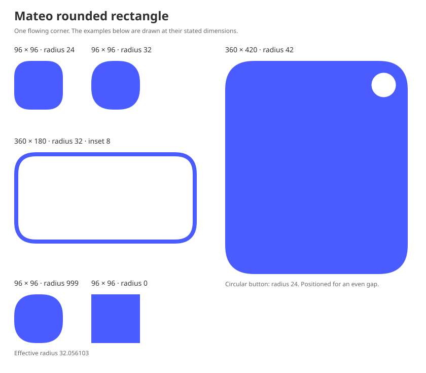
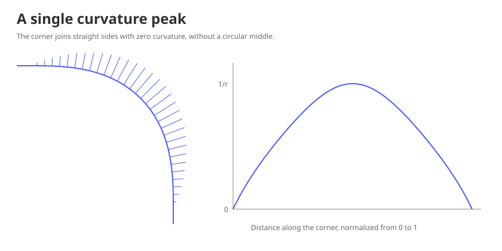

# Rounded rectangle — Mateo Design System

> This page records the previous rounded-rectangle outline used by the
> existing [rounded convex interpolation references](rounded-convex-interpolation.md).
> For current rounded rectangles and pills, use [Rounded shape](rounded-shape.md).

A Mateo rounded rectangle keeps straight sides and gives each corner one
flowing curve. The bend grows gradually, reaches its tightest point at the
middle, then relaxes into the next side. There is no circular middle section
and no smoothing setting.

Use this outline for non-pill surfaces with a component-defined radius. The
[border-radius foundation](border-radius.md) owns shape selection, states,
and motion. This outline does not define padding, hit targets, or content layout.



## Radius and fitting

The radius **R** is the smallest local radius of curvature: it describes the
tightest bend, not a circular arc or the distance from an edge to a circle
center. Each component chooses its requested radius.

Use finite, nonnegative radii. Reject negative or nonfinite radii. Empty bounds
have no outline: either dimension is nonpositive, or a dimension, origin, or
resulting bounds edge is nonfinite. Validate the radius before the bounds.
Radius zero in valid bounds produces an exact rectangle.

Let **W** and **H** be the width and height. Let **c** be the canonical corner's
maximum curvature, derived below; **c ≈ 1.497374792625798**. The largest radius
that fits is the shorter dimension divided by **2c**. Use the smaller of the
requested radius and this limit as the effective radius **r**.

Each corner occupies **e = cr** along both adjacent edges. Scale uniformly;
never stretch a corner along one axis. Increasing width or height only changes
straight-side lengths unless the fitting limit changes. Larger radius requests
beyond the limit produce the same outline. They do not select a capsule or
circle.

| Bounds    | Requested radius | Effective radius | Corner extent |
| --------- | ---------------: | ---------------: | ------------: |
| 96 × 96   |               24 |               24 |     35.936995 |
| 96 × 96   |               32 |               32 |     47.915993 |
| 96 × 96   |              999 |        32.056103 |            48 |
| 360 × 180 |               32 |               32 |     47.915993 |
| 360 × 420 |               42 |               42 |     62.889741 |

At the limit, straight sections on the shorter sides disappear. The corner
curve itself is unchanged. Fitting preserves position continuity during
resizing; it does not guarantee a continuous rate of shape change as the limit
is crossed. Component motion remains governed by the parent foundation.

## Canonical corner

All equations use real numbers, with at least binary64 precision in numerical
representations. Coordinates use positive x to the right and positive y down.
The canonical corner starts at **0** with a rightward tangent and ends at
**1 + i** with a downward tangent. A complex number **x + iy** represents the
point **(x, y)**; **i² = −1**.

Define the following constants from positive square roots:

```text
A = (20 + √2) / 140
B = (10 + 4√2) / 140
C = (12 + 9√2) / 140
ζ = [A + C + √((A − C)² + 4B²)] / 2
D = √[B² + (ζ − A)²] √ζ
λ = B / D
μ = (ζ − A) / D
z = (1 + i) / √2

w₀ = λ
w₁ = μ
w₂ = zμ
w₃ = zλ
```

The positive eigenvalue and positive components above are fixed. There is no
alternative branch or adjustable parameter. For reference,
**λ ≈ 1.270286578415877** and **μ ≈ 1.411804876664180**; derive them from the
equations rather than treating rounded values as independent tokens.

For **0 ≤ t ≤ 1**, define the Bernstein basis
**Bⱼⁿ(t) = binomial(n,j)(1−t)ⁿ⁻ʲtʲ**, and the cubic polynomial
**w(t) = Σⱼ₌₀³ wⱼ Bⱼ³(t)**. The canonical curve **p(t)** is the integral of
**w(t)²**, starting at zero. It is a degree-seven Pythagorean-hodograph (PH)
curve. Its degree-seven Bézier control points are:

```text
p₀ = 0
p₁ = p₀ + w₀² / 7
p₂ = p₁ + w₀w₁ / 7
p₃ = p₂ + (3w₁² + 2w₀w₂) / 35
p₄ = p₃ + (w₀w₃ + 9w₁w₂) / 70
p₅ = p₄ + (3w₂² + 2w₁w₃) / 35
p₆ = p₅ + w₂w₃ / 7
p₇ = p₆ + w₃² / 7 = 1 + i

p(t) = Σⱼ₌₀⁷ pⱼ Bⱼ⁷(t)
```

The position, speed, unit tangent **T**, and curvature **κ** satisfy:

```text
p′(t) = w(t)²
speed(t) = |w(t)|²
T(t) = w(t)² / |w(t)|²
κ(t) = 2 Im(conjugate(w(t)) w′(t)) / |w(t)|⁴
c = κ(1/2)
```

The speed is positive. Curvature starts at zero, increases to its sole maximum
at **t = 1/2**, and decreases back to zero. Position, tangent, and curvature
match the adjoining straight sides: these joins are **G2**, not G3 or G4.
The polynomial interior is smooth throughout.



## Complete outline

For effective radius **r > 0**, multiply the canonical curve by **e = cr**.
This makes its maximum curvature **1/r**. Construct the four corners in this
clockwise order, relative to the upper-left bound:

| Corner       | Point at parameter t  |
| ------------ | --------------------- |
| Top right    | (W − e) + ep(t)       |
| Bottom right | W + i(H − e) + iep(t) |
| Bottom left  | e + iH − ep(t)        |
| Top left     | ie − iep(t)           |

Connect successive corners with straight segments, including the last corner
back to the first, then close the path. Translate the complete outline by the
bounds origin. Zero-length straight segments at the fitting limit are allowed.
This construction works unchanged for portrait and landscape bounds.

## Following the outline with an inset

For a clockwise outline point **P(t)** with unit tangent **T(t)**, the inward
unit normal is **N(t) = iT(t)**. A constant normal inset **d** follows
**Pᵢ(t) = P(t) + dN(t)**. Offset straight sides by the same distance and connect
them to the offset corners.

Zero inset returns the same outline. The smooth offset described here supports
**0 < d < r**. Its curvature is **κᵢ = κ / (1 − dκ)**, so its smallest local
radius is **r − d**. Its tangent direction is unchanged and its speed stays
positive. Successive insets add while their total remains smaller than **r**.

For the `360 × 180` card with radius `32` and inset `8`, the gap is exactly `8`
along the normals and the inner minimum radius is `24`. Drawing a new
`344 × 164` rounded rectangle with radius `24` does **not** reproduce this
parallel outline.

At or beyond **d = r**, the regular offset formula can become singular. That
case needs a separate construction and is outside this smooth-offset contract.
The reference geometry rejects such insets, including positive insets on the
zero-radius rectangle. Nonfinite or negative insets are invalid.

## Aligning a circular element

For a corner's midpoint **M** and inward unit normal **N**, its curvature center
is **O = M + rN**. A smaller circular element can share **O** to align with the
tightest bend. This is a local curvature match, not a guarantee of the most
even visible gap.

The `360 × 420`, radius-`42` example instead places its radius-`24`
circular button at **(312.573565, 47.426435)**, measured from the upper-left
bound. Its center is **47.426435** from both the top and right bounds edges.
This placement minimizes the variation in the nearest-outline gap across the
circle's corner-facing quarter in the numerical reference study, with the
circle size fixed and its center constrained to the corner diagonal.
The gap varies approximately from **22.47 to 22.82**.

This placement belongs to this example; it is not a universal center inset for
other corner or button sizes. The button is a true circle, while the surrounding
corner has changing curvature. Their gap cannot be constant over an extended
angular interval. Components still own button size, spacing, and interaction
area.

## Cubic path representation

The canonical degree-seven polynomial defines the shape. For path systems
that accept cubic Bézier segments, the following fixed conversion reproduces
the same piecewise cubic geometry across platforms. Perform the conversion in
the canonical coordinates **before** applying the effective radius, corner
rotation, or bounds translation. No size-dependent smoothing or sampling
setting is introduced.

A cubic Bézier has a start point **b₀**, two control points **b₁, b₂**, and an
endpoint **b₃**. It follows **Σⱼ₌₀³ bⱼ Bⱼ³(u)** for **0 ≤ u ≤ 1**. These points
have the same geometric meaning in every path system.

### Cubic candidate

Start with the canonical controls **a₀, …, a₇ = p₀, …, p₇**. For each current
degree-seven segment, construct a cubic that matches its endpoint positions
and first derivatives:

```text
b₀ = a₀
b₁ = a₀ + (7/3)(a₁ − a₀)
b₂ = a₇ + (7/3)(a₆ − a₇)
b₃ = a₇
```

All derivatives here use the current segment's local parameter from zero to
one. The factor **7/3** accounts for the degrees of the source and target
curves; it is not a smoothing parameter.

### Error bound

Elevate the candidate cubic to degree seven without changing its geometry.
For controls **v₀, …, vₙ** of degree **n**, one elevation step produces:

```text
v̄₀ = v₀
v̄ⱼ = [j/(n + 1)]vⱼ₋₁ + [1 − j/(n + 1)]vⱼ,  1 ≤ j ≤ n
v̄ₙ₊₁ = vₙ
```

Repeat for degrees **3 → 4 → 5 → 6 → 7**. Call the resulting controls
**b̂₀, …, b̂₇**. Let **E** be the largest Euclidean length among the eight
difference vectors **aⱼ − b̂ⱼ**. Accept the original four-point cubic when
**E ≤ 10⁻⁶/c**, including equality.

The Bernstein basis is nonnegative and sums to one, so **E** bounds the
position difference between the two curves at every corresponding parameter.
After scaling by **e = cr**, the bound is **10⁻⁶r**. Rotation and translation
do not change this geometric bound in exact arithmetic.

### Subdivision and ordering

If the candidate exceeds the bound, split the degree-seven segment exactly
at its parameter midpoint using de Casteljau subdivision:

```text
aⱼ⁽⁰⁾ = aⱼ
aⱼ⁽ᵏ⁾ = (aⱼ⁽ᵏ⁻¹⁾ + aⱼ₊₁⁽ᵏ⁻¹⁾) / 2,
          1 ≤ k ≤ 7,  0 ≤ j ≤ 7 − k

Left controls:  a₀⁽⁰⁾, a₀⁽¹⁾, …, a₀⁽⁷⁾
Right controls: a₀⁽⁷⁾, a₁⁽⁶⁾, …, a₇⁽⁰⁾
```

Construct and check a new cubic for each half. Repeat until every segment
passes; retain all accepted cubics in increasing parameter order, with the
left half before the right half. Use the same canonical tolerance for every
subdivision, rather than dividing the tolerance among the halves.

For this fixed canonical curve and tolerance, the result is **32 cubics per
corner**, covering parameter intervals **[j/32, (j + 1)/32]** for **j = 0, …, 31**.
This provides a reproducibility check for the conversion; it does not replace
the error test or introduce a configurable segment count.

Scale and place each accepted control point using the four corner transforms
in [Complete outline](#complete-outline). Move to the first corner's start,
append its cubic segments, connect to the next corner's start with a straight
segment, and continue clockwise. Close the final edge back to the first start.
The resulting outline has no stroke or inset by itself.

The normalized cubic controls depend only on the fixed canonical curve, so
they may be reused across sizes. Reuse does not change the geometry. A platform
with an upward-positive y axis must reflect the coordinates consistently;
changing the coordinate convention must not mirror only part of the outline.

### Precision and continuity

Use at least binary64 arithmetic for the construction and error checks.
The **10⁻⁶r** cubic bound covers the mathematical conversion before the native
path system stores coordinates or rasterizes the path. Native coordinate
rounding, transforms, and antialiasing can add error; identical cubic inputs
do not guarantee pixel-identical images across renderers. This is distinct
from the complete SVG-reference error budget below.

The cubic conversion preserves endpoint positions and tangents. It does not
preserve the exact polynomial's curvature at every segment join, so the
canonical curve's G2 guarantee must not be attributed to the cubic
approximation. The position-error bound remains the comparison criterion.

The conversion above applies to the outer degree-seven curve. A normal inset
is a rational curve, not a fresh degree-seven rounded rectangle. Use the
normal-offset equations and rational reference representation below for that
outline; do not reuse the outer cubic conversion with a reduced radius.

## Portable reference representation

The polynomial equations are authoritative. The accompanying
[`reference.json`](assets/rounded-rectangle/reference.json) provides the canonical
hodograph coefficients, degree-seven control points, sampled positions,
tangents and curvatures, and example bounds with effective radii and alignment
coordinates. Use these fixtures to check an implementation against the
specified geometry; they are not a size lookup table or a replacement for the
equations. The cubic segments are derived using the conversion above.

SVGs approximate the outline with line segments to a maximum geometric error
of **10⁻⁶r**. Radius zero uses exact straight segments.

Subdivision at the parameter midpoint bounds each polynomial segment by its
control polygon. For a positive-weight rational segment, use its Euclidean
control points in the same convex-hull bound. Stop when every control point is
within the permitted distance of the endpoint chord segment. This bounds both
directions of distance between the curve and chord.

An offset corner has the exact rational form
**ep(t) + id w(t)² / |w(t)|²**. Its numerator has degree thirteen and its
denominator degree six. Elevate the denominator and the normal numerator to
degree thirteen to represent it as a rational Bézier segment. All denominator
weights are positive for this canonical corner. This allows the same bounded
subdivision to render an inset.

SVG reference renderers must account for arithmetic and coordinate serialization
within their complete error budget. The reference uses half the tolerance for subdivision
and requires coordinate spacing in binary64 to be at most one sixteenth of
the tolerance; otherwise it reports unrepresentable output instead of silently
weakening the bound. Rendering approximations do not themselves inherit the
exact curve's continuity guarantees.
