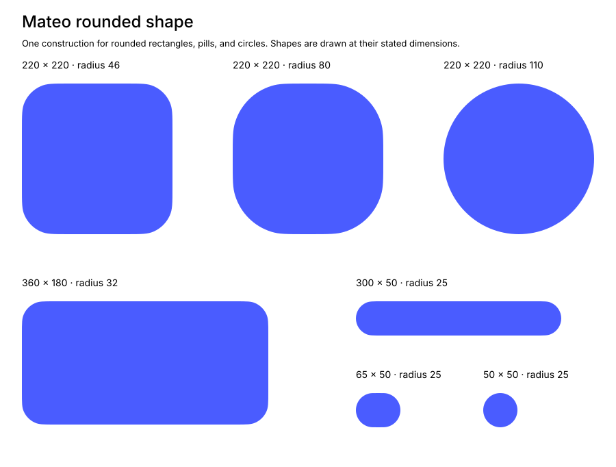
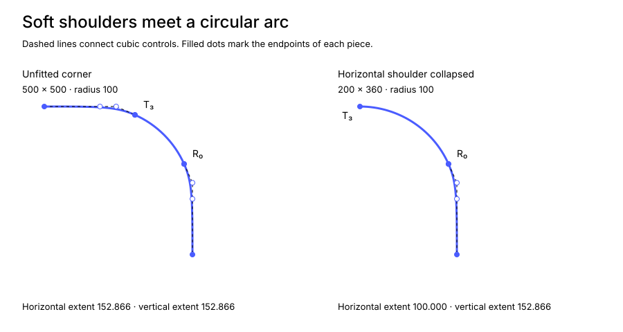

# Rounded shape — Mateo Design System

Mateo's rounded shape is inspired by Apple's continuous rounded corners.
It gives rectangles, pills, and circles one shared outline: straight sides,
soft shoulders, and circular bends that adapt to the available space.

Use a component-defined radius for a rounded surface and full rounding for a
pill. Equal dimensions at full rounding produce an exact circle. The
[border-radius foundation](border-radius.md) owns shape selection, component
roles, states, and motion. This document defines the outer outline; it does
not define layout, constant-distance insets, or interpolation between
different shapes.



## Dimensions and radius

Let **W** and **H** be the width and height, and **R** the requested radius.
Coordinates increase to the right and down. Construct the outline relative to
the top-left bound, then add the bound's origin to every point.

Use finite, nonnegative radii. Reject a negative or nonfinite radius before
checking the bounds. Empty bounds have no outline: either dimension is
nonpositive, or a dimension, origin, or resulting bounds edge is nonfinite.

For valid bounds, let **r** be the smaller of **R**, **W/2**, and **H/2**.
This is the effective radius. Requests above half the shorter dimension
produce the same fully rounded outline.

**R is a rounding parameter.** The circular part of a corner has radius r,
but its shoulder can bend more tightly. R is neither the distance occupied
by a corner along an edge nor a guaranteed minimum local curvature radius.

Radius zero produces an exact rectangle: join the four bounds corners with
straight segments and close the outline. Do not evaluate the remaining
equations for radius zero.

## Shared coefficients

These dimensionless values define the outline. Use the stated values with at
least binary64 precision; do not adjust them by component. All angles in the
construction are in radians.

| Symbol |               Value |
| ------ | ------------------: |
| **a**  |  1.5286649465560913 |
| **θ₀** |  0.4188790204786391 |

**a** is the unfitted corner extent in radius units. **θ₀** is the unfitted
shoulder's turn, 24°. The two shoulders leave a circular arc
between them.

## Fit each axis

Fit the horizontal and vertical directions independently. For either
dimension **D**, with **D = W** or **D = H**:

1. Let **aᴰ** be the smaller of **a** and **D/(2r)**.
2. Calculate **uᴰ = (aᴰ − 1)/(a − 1)**.
3. Calculate **θᴰ = θ₀uᴰ**.
4. Calculate **qᴰ = tan(θᴰ/2)**.
5. Calculate **bᴰ = 1 − qᴰ/4 + 3(qᴰ)³/4** and **cᴰ = 1 − qᴰ**.
6. Calculate **sᴰ = 2qᴰ/(1 + (qᴰ)²)** and
   **vᴰ = 2(qᴰ)²/(1 + (qᴰ)²)**.

The radius limit ensures **1 ≤ aᴰ ≤ a**, **0 ≤ uᴰ ≤ 1**, and
**0 ≤ θᴰ ≤ θ₀**. The values **sᴰ** and **vᴰ** equal **sin θᴰ** and
**1 − cos θᴰ**. The stated forms retain precision as the angle approaches
zero.

Use the horizontal results with superscript **x** and the vertical results
with superscript **y**. The corner occupies **eˣ = raˣ** along the horizontal
edge and **eʸ = raʸ** along the vertical edge. The remaining straight section
on a horizontal side has length **W − 2eˣ**; on a vertical side it has length
**H − 2eʸ**.

When **D ≥ 2ar**, that axis uses the unfitted shoulder. Otherwise, the corner
reaches the midpoint of the side and the shoulder's angle decreases with the
available room. At **D = 2r**, the shoulder has zero extent along its curve
and is omitted; the circular arc reaches the side directly.

| Bounds    | Requested R | Effective r | Horizontal extent eˣ | Vertical extent eʸ |
| --------- | ----------: | ----------: | -------------------: | -----------------: |
| 500 × 500 |          72 |          72 |           110.063876 |         110.063876 |
| 220 × 220 |          80 |          80 |                  110 |                110 |
| 300 × 50  |          25 |          25 |            38.216624 |                 25 |
| 65 × 50   |          25 |          25 |                 32.5 |                 25 |
| 96 × 96   |         999 |          48 |                   48 |                 48 |

## Construct one corner

The top-right corner runs from the top edge toward the right edge. It has a
cubic top shoulder, an exact circular arc, and a cubic right shoulder.

### Top shoulder

Define its four points:

| Point  | X           | Y   |
| ------ | ----------- | --- |
| **T₀** | W − raˣ     | 0   |
| **T₁** | W − rbˣ     | 0   |
| **T₂** | W − rcˣ     | 0   |
| **T₃** | W − r + rsˣ | rvˣ |

Draw a cubic Bézier from **T₀** to **T₃**, with controls **T₁** and **T₂**.
When **θˣ = 0**, all four points coincide. Omit this zero-length cubic.

### Circular arc

Use the [circle geometry](border-radius.md#circle-geometry), with center
**(W − r, r)** and radius **r**. Draw its arc with angle increasing from
**−π/2 + θˣ** to **−θʸ**. Increasing angles travel clockwise in the chosen
screen coordinates. The sweep is **π/2 − θˣ − θʸ**.

The arc starts at **T₃** and ends at **R₀**, defined below. Reuse these shared
endpoints when constructing a path. Keep the arc circular; replacing it with
an ordinary polynomial cubic introduces a circle approximation.

### Right shoulder

Define its four points:

| Point  | X       | Y       |
| ------ | ------- | ------- |
| **R₀** | W − rvʸ | r − rsʸ |
| **R₁** | W       | rcʸ     |
| **R₂** | W       | rbʸ     |
| **R₃** | W       | raʸ     |

Draw a cubic Bézier from **R₀** to **R₃**, with controls **R₁** and **R₂**.
When **θʸ = 0**, all four points coincide. Omit this zero-length cubic.

A cubic with points **A, B, C, D** is evaluated for **0 ≤ t ≤ 1** as:

```text
P(t) = (1 − t)³A + 3(1 − t)²tB + 3(1 − t)t²C + t³D
```



### Smooth joins

Each nonzero shoulder leaves its straight side with matching tangent and
zero curvature. At its arc endpoint, its tangent follows the circle and its
curvature is **1/r**. The arc has that same curvature throughout. These are
geometric tangent and curvature matches, also called **G² continuity**;
the curve parameters do not need to have equal speeds.

For a top shoulder, let **q = qˣ** and **θ = θˣ**. The last control-to-endpoint
vector has length **ℓ = rq** and direction **(cos θ, sin θ)**. The horizontal
distance from **T₁** to **T₂** is **B = 3rq(1 + q²)/4**. A cubic's curvature
at this endpoint is **2B sin θ/(3ℓ²)**. Substituting **sin θ = 2q/(1 + q²)**
gives **1/r**. The right shoulder follows by reflection. This derivation
applies to nonzero shoulders; zero-angle shoulders are omitted.

## Complete the outline

Reflect the entire top-right corner, including its arc center and both
shoulder controls, to construct the other corners:

| Corner       | Point transformation | Traversal |
| ------------ | -------------------- | --------- |
| Top right    | (X, Y)               | Forward   |
| Bottom right | (X, H − Y)           | Reverse   |
| Bottom left  | (W − X, H − Y)       | Forward   |
| Top left     | (W − X, Y)           | Reverse   |

Reverse traversal reverses the order of the pieces and the controls within
each cubic. Each reflected arc still follows the corner clockwise; choose
its increasing-angle sweep between its transformed endpoints, at most π/2.

1. Begin at the right-side midpoint **(W, H/2)**.
2. Visit the bottom-right, bottom-left, top-left, and top-right corners, in
   that order.
3. Before each corner, draw a straight segment to its first point. Then append
   its nonzero shoulder cubics and circular arc in traversal order.
4. Close the path back to the starting midpoint.

Zero-length straight segments may be omitted. Translate all points and arc
centers by the bounds origin after constructing them. Evaluate both axis fits
for the current dimensions before reflecting the corner.

## Pills and circles

For a pill, request a radius of half the shorter dimension. Re-evaluate the
same construction when the bounds change. On its short axis the shoulders
have disappeared, so each end crosses its midpoint with circular curvature.
The long-axis shoulders retain the pill's soft connection to its straight
sides.

For equal dimensions at full rounding, both shoulder angles are zero. All
four arc centers coincide at the bounds center, and the four quarter-circle
arcs make one **exact circle**. There are no flattened midpoints and no
special substitute outline at the endpoint. As the radius approaches full
rounding, the shoulders continuously shrink to zero.

Use the platform's circle primitive for this full-rounding square when
available. It represents the same geometry. Circle usage remains defined by
the [border-radius foundation](border-radius.md#circle-geometry).

## Nesting and rendering

Keep backgrounds, clipping, borders, feedback, and shadows on the same
finished outline. Padding and hit targets remain component decisions.

A smaller rounded shape with a reduced radius is not generally a constant
normal offset of a larger one. Choose a nested component's dimensions,
radius, and spacing together, following the
[nesting guidance](border-radius.md#rounded-shapes-inside-other-shapes).

Render the shoulders as cubics and the bends as circular arcs. A native
circle or arc primitive, or an exact rational representation, preserves the
circular definition. If a renderer needs polynomial curves or line segments,
its approximation must be checked at the intended display scale; it does not
replace the mathematical definition. Keep full-precision coordinates until
they reach the renderer.

## Portable references

The equations and coefficients above are the source of truth. The
[reference fixtures](assets/rounded-shape/reference.json) contain the
coefficients, fitted axis values, shoulder controls, circular arc centers and
angles, closed path instructions, and sampled positions for representative
dimensions and radii.

Use the fixtures to check an independent implementation. The
[reference silhouettes](assets/rounded-shape/reference.svg) show the selected
outline across sizes, while the
[corner construction](assets/rounded-shape/construction.svg) identifies its
shoulders and circular arc.
